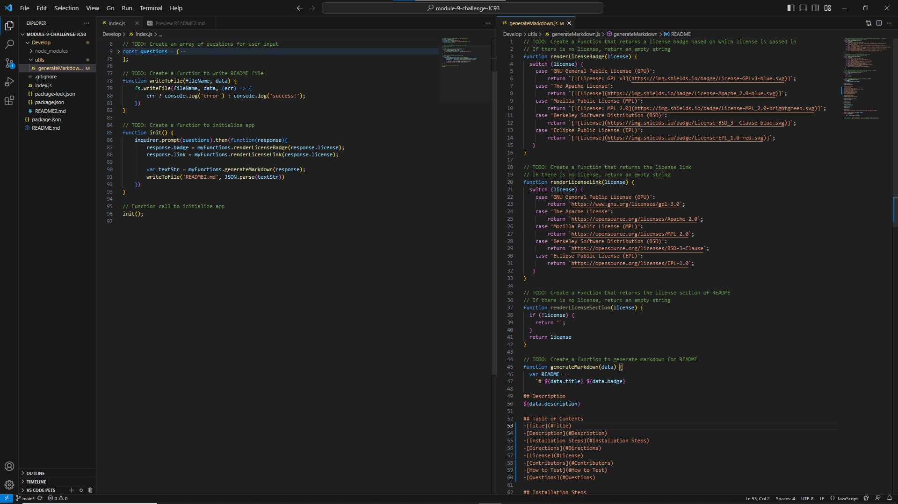

# Module 9 Challenge 

## Description
We were asked to design a command line application that would generate a professional README.md, through the use of javascript, node packages, and scripts saved as module exports. 

## Table of Contents
-[Title](#Title)
-[Description](#Description)
-[Installation_Steps](#Installation_Steps)
-[Directions](#Directions) 
-[License](#License)
-[Contributors](#Contributors)
-[How_to_Test](#How_to_Test)
-[Questions](#Questions)

## Installation Steps
By cloning the repository off of gitHub.

## Directions on how to use
Navigate to the Develop folder within the downloaded repository via command line. run ~$ node index.js; answer the following prompts. 

## License
Berkeley Software Distribution (BSD)

## Contributors
Me, myself and I. 

## How to Test
By following the directions and looking over the produced README.md. 

## Questions
If you have any questions, feel free to contact me via email or gitHub.

gitHub: https://github.com/justinschoi93
email: justinschoi93@gmail.com