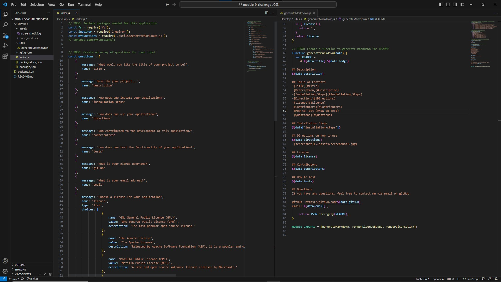

# Justin's README.md Generator

## Technology Used 

| HTML            | (https://developer.mozilla.org/en-US/docs/Web/HTML)| 
| Javascript      | (https://developer.mozilla.org/en-US/docs/Web/JavaScript)|   
| Node - Inquirer | (https://www.npmjs.com/package/inquirer)
| Node - fs       | (https://nodejs.org/api/fs.html)

## Description 

A Command Line Application that generates a README.md for professional use. 

## Usage 
1. Navigate to Main 
2. Run ~$ npm install
3. Run ~$ node index.js
4. Answer the following prompts in your CLI/terminal
5. The README.md will appear in Main/fin

## Learning Points 

The purpose of this challenge was to practice writing javascript code. To be more specific, we were given the task of developing a Command Line Application through the use of node packages, fs and inquirer, that generates a README.md of professional quality.

## My Info

* [LinkedIn](https://linkedin.com/in/justinschoi93)
* [Github](https://github.com/justinschoi93)
* [Email](justinschoi93@gmail.com)
